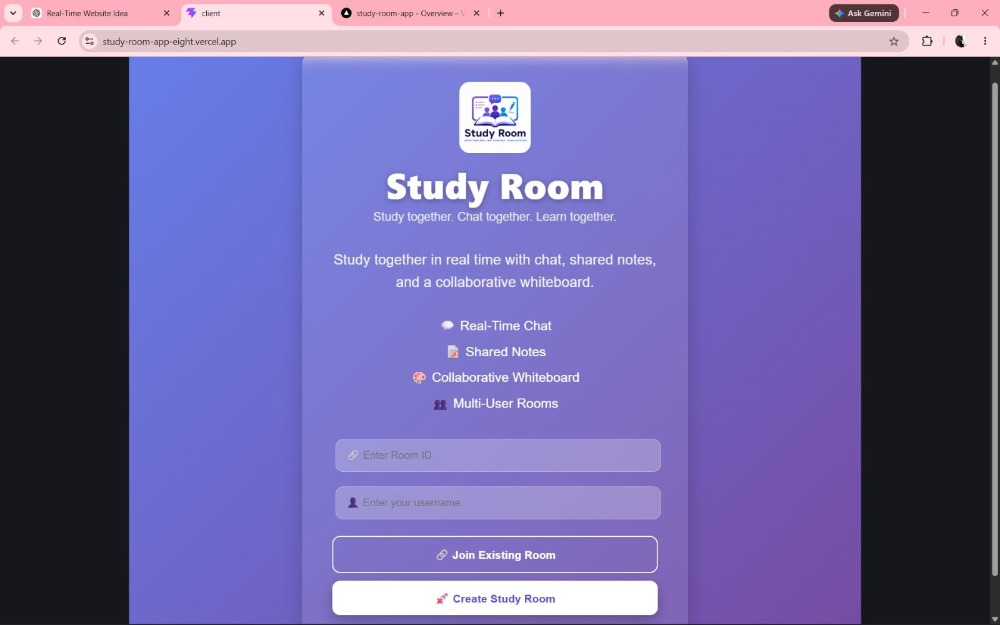
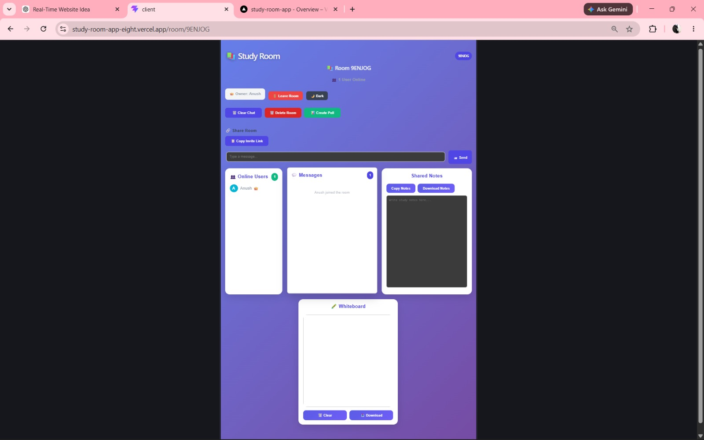
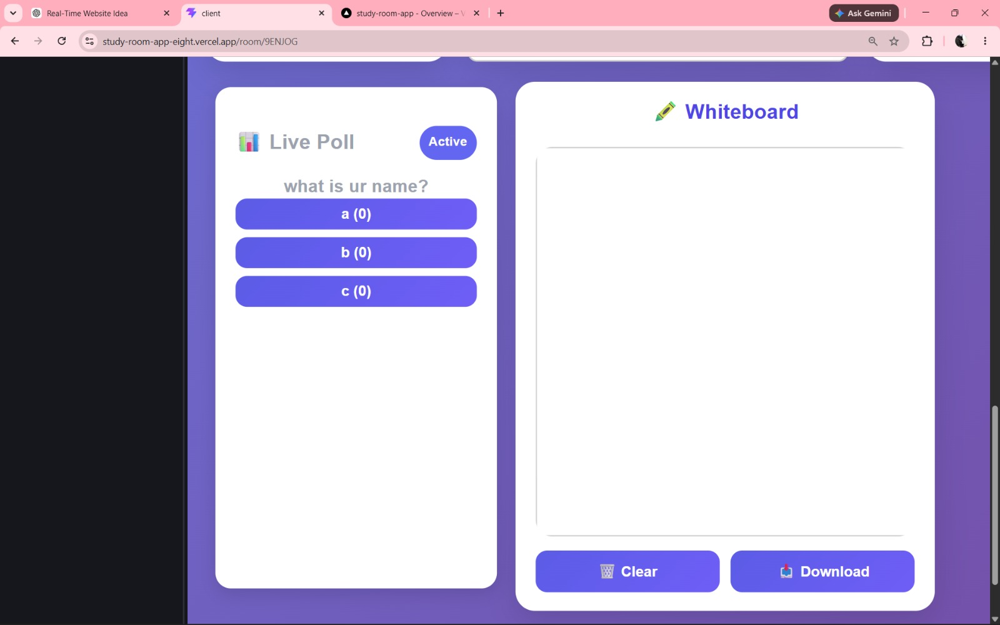
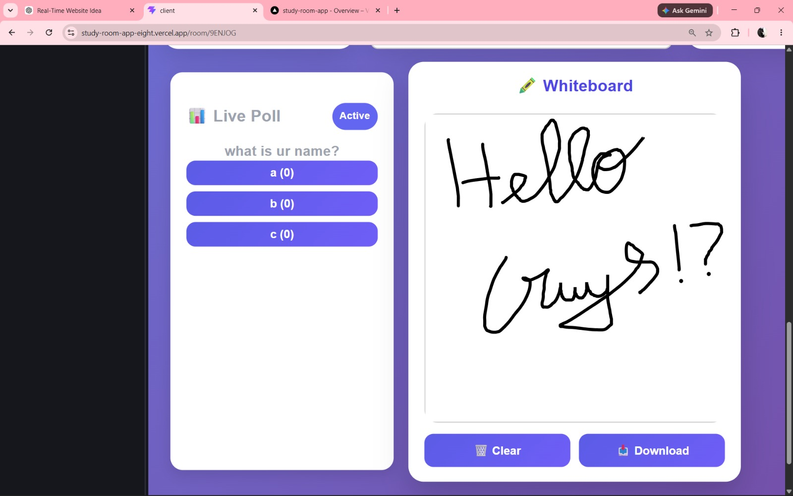
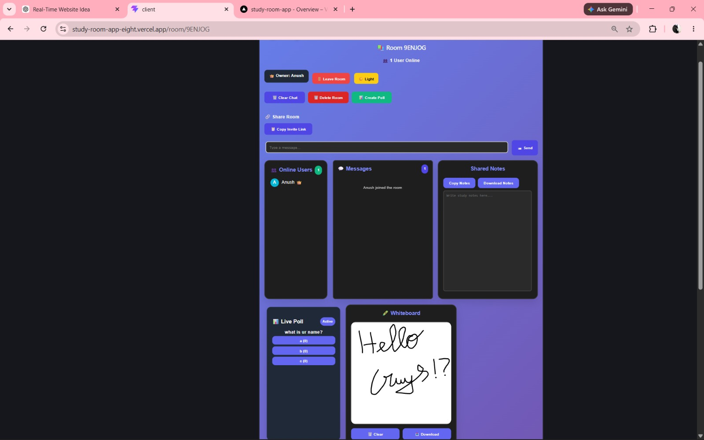

# 📚 Real-Time Study Room

A full-stack real-time collaboration platform where users can create or join study rooms to chat, share notes, draw on a collaborative whiteboard, and participate in live polls.

## 🚀 Live Demo

**Frontend:** https://study-room-app-eight.vercel.app

**Backend:** https://study-room-app-backend.onrender.com

---

## ✨ Features

* 💬 Real-time chat using Socket.IO
* 👥 Live online users list
* 📝 Shared notes with instant synchronization
* 🎨 Collaborative whiteboard
* 📊 Live polls with real-time voting
* 👑 Room owner controls

  * Delete room
  * Clear chat
  * Kick users
* 🔗 Share room using invite link
* 🌙 Dark mode
* 📥 Download whiteboard
* 📄 Download shared notes
* 📱 Responsive design

---

## 🛠 Tech Stack

### Frontend

* React
* React Router
* Socket.IO Client
* React Sketch Canvas
* React Hot Toast
* CSS

### Backend

* Node.js
* Express.js
* Socket.IO

### Deployment

* Vercel (Frontend)
* Render (Backend)

---

## ⚙️ Installation

### Clone the repository

```bash
git clone https://github.com/YOUR_USERNAME/study-room-app.git
```

### Install dependencies

Frontend

```bash
cd client
npm install
npm run dev
```

Backend

```bash
cd server
npm install
npm start
```

---

## 📸 Screenshots

### Home Page



### Chat Room



### Live Poll



### Whiteboard



### Dark Mode



---

## 🎯 Future Improvements

* User authentication
* File sharing
* Voice and video calls
* Emoji reactions
* Notification sounds
* Message search

---

## 👨‍💻 Author

**Anush**

Built as a full-stack real-time collaboration project using React, Node.js, Express, and Socket.IO.
